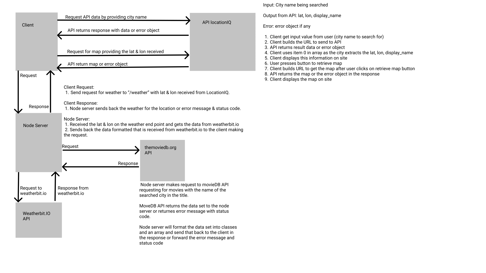

# City Explorer App (Lab 09)

**Deployed URL**: https://city-explorer-ayrat.netlify.app/
**Author**: Ayrat Gimranov
**Version**: 1.0.4 (increment the patch/fix version number if you make more commits past your first submission)

## Overview
<!-- Provide a high level overview of what this application is and why you are building it, beyond the fact that it's an assignment for this class. (i.e. What's your problem domain?) -->
In this lab we modularize back-end and front-end, refactoring our codebase.

## Getting Started
<!-- What are the steps that a user must take in order to build this app on their own machine and get it running? -->
- mpn install express, cors, dotenv.

- Set up a new server.

- compose a url to request data from back-end.

- Handle the request from front-end using .find(), then popualting an array with necessary data.

- Send the data to front-end.

- Display the results using react-bootstrap

- code try/catch to handle errors

## Architecture
<!-- Provide a detailed description of the application design. What technologies (languages, libraries, etc) you're using, and any other relevant design information. -->
- Langauges - HTML, CSS, JavaScript
- Libraries - React, React-bootstrap, Axios,
- Tools - GitHub, Netlify, Heroku, Trello, Creatly  

## Change Log
<!-- Use this area to document the iterative changes made to your application as each feature is successfully implemented. Use time stamps. Here's an example:

01-01-2001 4:59pm - Application now has a fully-functional express server, with a GET route for the location resource. -->
8/8/2021 3.30 am - Feature 1: Modularized back-end codebase.

## Credit and Collaborations
<!-- Give credit (and a link) to other people or resources that helped you build this application. -->
Classmates: Quentin, Willem, Clarissa, Alex
Staff: Ryan Gallaway, JP

---------------

Name of feature 1. Refactor: Modularize the back-end codebase.

Estimate of time needed to complete: 1 hrs

Start time: 2.45 pm

Finish time: 3.30 am

Actual time needed to complete: 45 mins

-------

Name of feature 2. Refactor: Componentize the front-end codebase.

Estimate of time needed to complete: 4 hrs

Start time: 

Finish time: 

Actual time needed to complete: 
