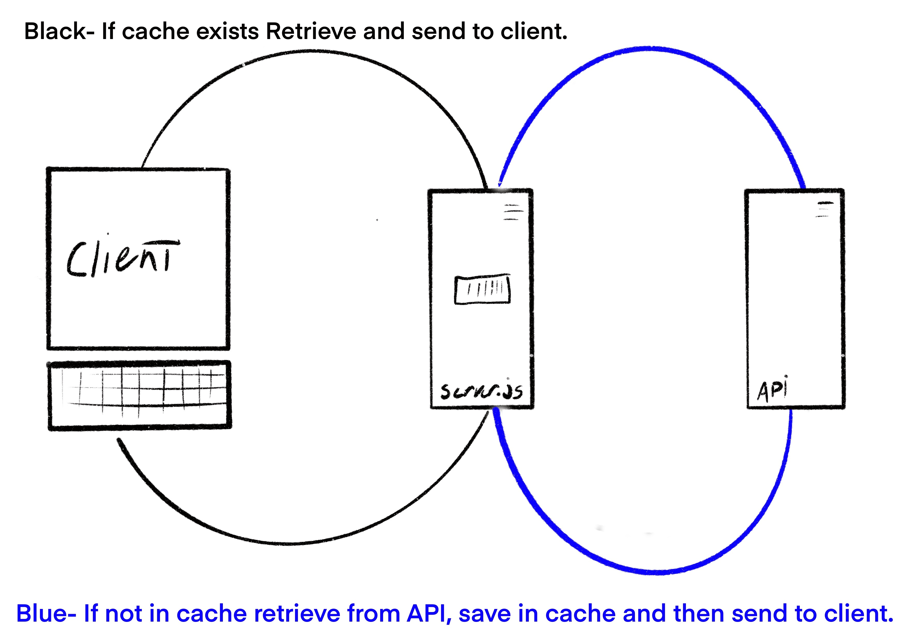

# City Explorer App (Lab 10)

**Deployed URL**: https://city-explorer-ayrat.netlify.app/
**Author**: Ayrat Gimranov
**Version**: 1.0.5

## Overview
<!-- Provide a high level overview of what this application is and why you are building it, beyond the fact that it's an assignment for this class. (i.e. What's your problem domain?) -->
In this lab we modularize back-end and front-end, refactoring our codebase.

## Getting Started
<!-- What are the steps that a user must take in order to build this app on their own machine and get it running? -->
- mpn install express, cors, dotenv.

- Set up a new server.

- compose a url to request data from back-end.

- Handle the request from front-end using .find(), then popualting an array with necessary data.

- Send the data to front-end.

- Display the results using react-bootstrap

- code try/catch to handle errors

## Architecture
<!-- Provide a detailed description of the application design. What technologies (languages, libraries, etc) you're using, and any other relevant design information. -->
- Langauges - HTML, CSS, JavaScript
- Libraries - React, React-bootstrap, Axios,
- Tools - GitHub, Netlify, Heroku, Trello, Creatly  

## Change Log

<!-- Use this area to document the iterative changes made to your application as each feature is successfully implemented. Use time stamps. Here's an example:

01-01-2001 4:59pm - Application now has a fully-functional express server, with a GET route for the location resource. -->
8/12/2021 3.30 am - Feature 1: Added cache to server

## Credit and Collaborations
<!-- Give credit (and a link) to other people or resources that helped you build this application. -->
Classmates: Quentin, Willem, Clarissa, Alex, Jamison
Staff: Ryan Gallaway, JP, TA's

---------------

Name of feature 1. Performance: As a user, I want the application to work with recent results, so that I can see info without the app doing unnecessary API calls.

Estimate of time needed to complete: 2 hrs

Start time: 10 pm

Finish time: 7 am

Actual time needed to complete: 9 hrs (including breaks and lecture)

