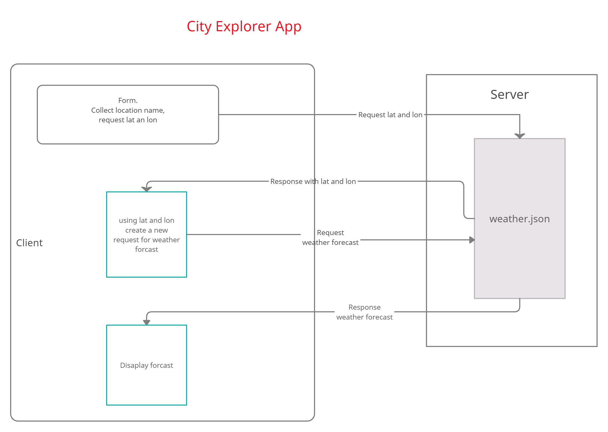

# City Explorer App (Lab 07)

**Author**: Ayrat Gimranov
**Version**: 1.0.2 (increment the patch/fix version number if you make more commits past your first submission)

## Overview
<!-- Provide a high level overview of what this application is and why you are building it, beyond the fact that it's an assignment for this class. (i.e. What's your problem domain?) -->
This lab teaches us to build our first back-end server. The app is pulling weather data from our locally built back-end and displaying the result by dates, as well as handling errors.

## Getting Started
<!-- What are the steps that a user must take in order to build this app on their own machine and get it running? -->
- mpn install express, cors, dotenv.

- Set up a new server.

- compose a url to request data from back-end.

- Handle the request from front-end using .find(), then popualting an array with necessary data.

- Send the data to front-end.

- Display the results using react-bootstrap

- code try/catch to handle errors

## Architecture
<!-- Provide a detailed description of the application design. What technologies (languages, libraries, etc) you're using, and any other relevant design information. -->
- Langauges - HTML, CSS, JavaScript
- Libraries - React, React-bootstrap, Axios,
- Tools - GitHub, Netlify, Trello, Creatly  

## Change Log
<!-- Use this area to document the iterative changes made to your application as each feature is successfully implemented. Use time stamps. Here's an example:

01-01-2001 4:59pm - Application now has a fully-functional express server, with a GET route for the location resource. -->
8/1/2021 6 am - Feature 1: Server repository is set up.
8/2/2021 2.30 am - Feature 2 complete: Displaying weather data: date and description using react-bootstrap cards.
8/2/2021 4 am - Feature 3 complete: Weather data error handling is added.

## Credit and Collaborations
<!-- Give credit (and a link) to other people or resources that helped you build this application. -->
Classmates: Quentin, Willem, Clarissa
Staff: Ryan Gallaway

---------------

Name of feature: 1. Set up your React repository & API keys.

Estimate of time needed to complete: 2 hrs

Start time: 1.30 am

Finish time: 6 am

Actual time needed to complete: 4.5 hours

-------

Name of feature: 2. Weather (placeholder): As a user of City Explorer, I want to see weather info for the city I searched, so that I know how to pack for an upcoming trip.

Estimate of time needed to complete: 3 hrs

Start time: 9.30 pm

Finish time: 2.30 am

Actual time needed to complete: 5 hours

--------

Name of feature: Errors (revisited): As a user, I want clear messages if something goes wrong so I know if I need to make any changes or try again in a different manner.

Estimate of time needed to complete: 2 hrs

Start time: 2.30 am

Finish time: 4 am

Actual time needed to complete: 1.5 hrs
